<div align="center">

<!-- 🖥️ custom hand-crafted animated terminal (assets/header.svg) -->


<br><br>

<a href="https://github.com/pammytv2"></a>
<a href="mailto:Natchaphon11th@gmail.com"></a>


</div>

<br>

## `❯ tree ~/tech-stack`

```text
tech-stack
├── languages/    python · javascript · c++ · dart · c# · php
├── backend/      node.js · express · asp.net · laravel
├── mobile/       flutter
├── frontend/     html · css · vue
├── database/     mysql · mongodb · firebase
└── ops/          git · docker · postman · unity · linux
```

<div align="center">


</div>

<br>

## `❯ ls ~/projects --featured`

<div align="center">

| | project | description | stack |
|:---:|:---|:---|:---:|
| 🏎️ | **[Game_driving_simulator](https://github.com/pammytv2/Game_driving_smiulator)** | 3D car driving simulator game | `C#` `Unity` |
| 🔐 | **[RoleBasedProductAPI](https://github.com/pammytv2/RoleBasedProductAPI)** | Product API with role-based access control | `Backend` |
| 🛍️ | **[Review_Shop](https://github.com/pammytv2/Review_Shop)** | Shop review web application | `Laravel` |
| ✅ | **[ToDo_List](https://github.com/pammytv2/ToDo_List)** | Task management web app | `Laravel` |
| 🌡️ | **[ESP8266_IoT_Monitor](https://github.com/pammytv2/temperature-and-humidity-as-well-ESP8266)** | Realtime temp & humidity dashboard | `Vue` `IoT` |
| 🪪 | **[Profile_dev](https://github.com/pammytv2/Profile_dev)** | Personal portfolio website | `CSS` |

</div>

<br>

## `❯ git log --stats`

<div align="center">


<br><br>


<br><br>


</div>

<br>

<div align="center">

`❯ exit`

<sub><code>// end of transmission — but the coffee never stops brewing ☕</code></sub>

<br><br>


</div>
