<!-- 🎮 hand-crafted animated RPG character-select banner (assets/header.svg) -->

  

 

## 🗡️ SKILL TREE

<!-- animated skill bars (assets/skills.svg) -->

### 🎒 INVENTORY

 

## 📜 QUEST LOG

| | QUEST | OBJECTIVE | CLASS | STATUS |
|:---:|:---|:---|:---:|:---:|
| 🏎️ | **[Game_driving_simulator](https://github.com/pammytv2/Game_driving_smiulator)** | Build a 3D car driving simulator | `C#` `Unity` | ✅ CLEARED |
| 🔐 | **[RoleBasedProductAPI](https://github.com/pammytv2/RoleBasedProductAPI)** | Forge an API with role-based access | `Backend` | ✅ CLEARED |
| 🛍️ | **[Review_Shop](https://github.com/pammytv2/Review_Shop)** | Craft a shop review web app | `Laravel` | ✅ CLEARED |
| ✅ | **[ToDo_List](https://github.com/pammytv2/ToDo_List)** | Tame the chaos of daily tasks | `Laravel` | ✅ CLEARED |
| 🌡️ | **[ESP8266_IoT_Monitor](https://github.com/pammytv2/temperature-and-humidity-as-well-ESP8266)** | Sense the realm's temp & humidity | `Vue` `IoT` | ✅ CLEARED |
| ☁️ | **Cloud & DevOps Mastery** | Unlock the cloud arts | `DevOps` | 🔄 IN PROGRESS |

 

## 🏆 ACHIEVEMENTS

  

  

 

`💀 GAME OVER?` — `INSERT ☕ TO CONTINUE`

  

